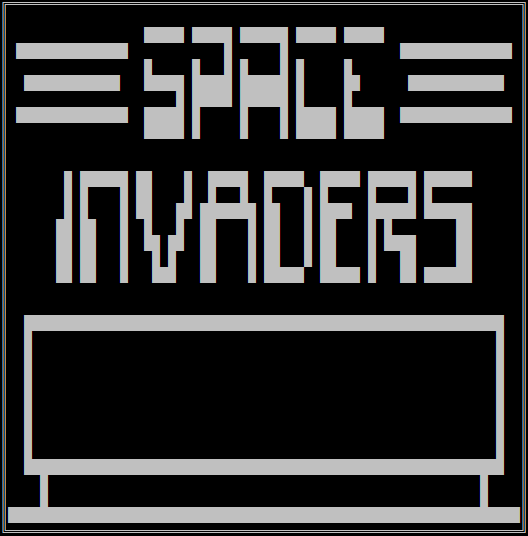

# Constexpr Chip8
A cross-platform, C++17 compile time [Chip8](https://en.wikipedia.org/wiki/CHIP-8) emulator.

It should go without saying that an emulator that doesn't support inputs and produces only a single frame buffer after the ROM code halts isn't very useful from a usability perspective. Making this emulator was purely an exercise in constexpr metaprogramming. 

Executing the compiled program renders the final frame buffer. Unfortunately C++ doesn't support compile time printing just yet :(

